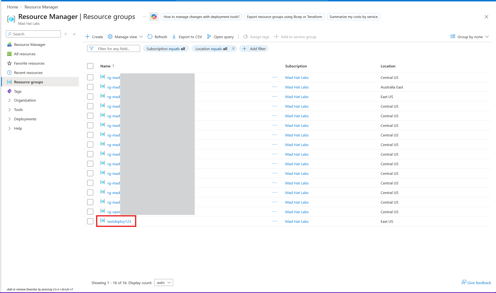
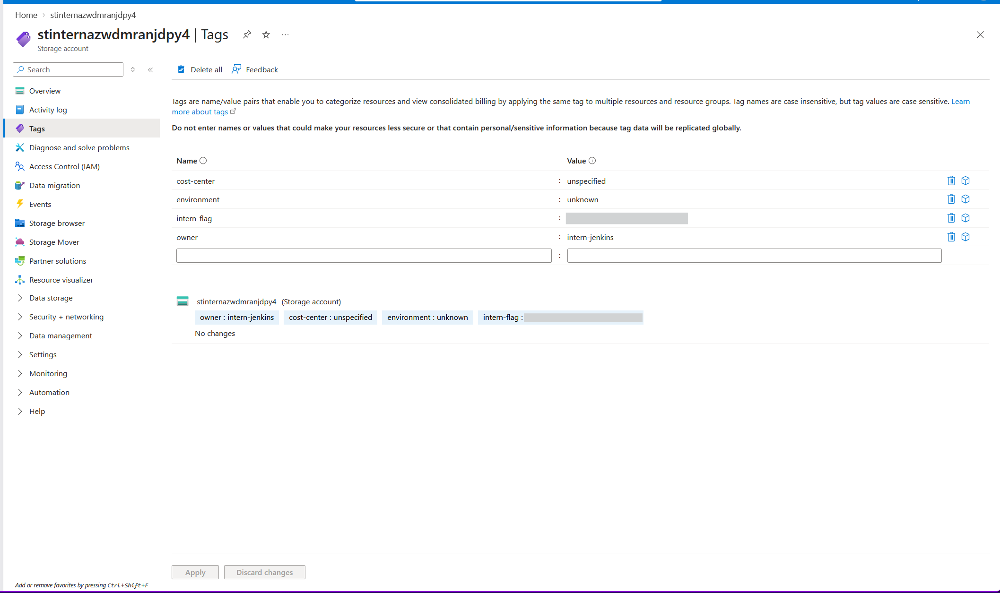
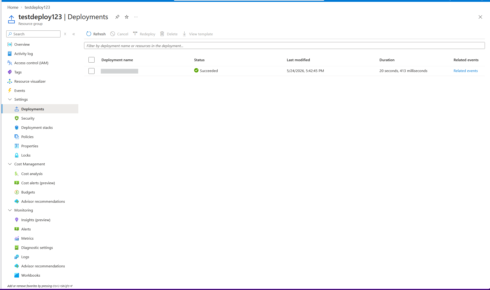
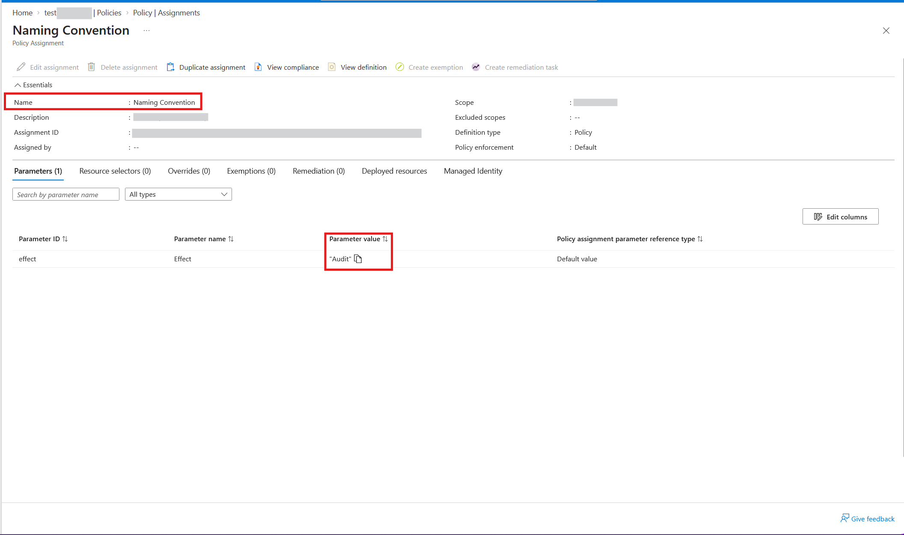

# OPERATION DEAD DEPLOY 

## Scenario
The scenario: an intern with temporary Contributor access deployed a "test environment" over a weekend, cut every corner, and left. You come in Monday as the on-call engineer with Reader access and have to reconstruct what happened and why governance did not stop it.

## Environment
Live multi-user Azure training tenant, Reader access.

## Investigation
#### Step 01.
Identify anything that could indicate it is the interns "test environment." A resource must belong to a resource group, so the first place I checked was resource groups. I found the offender. A resource group that doesn't match the standard naming convention. Microsoft's official recommended naming convention recommends all resource groups start with "rg" prefix.  

#### Step 02.
Inside the resource group is a single resource. I opened the resource and inspected it's tags. Tags should tell the story of the resource, who created it and why. To the interns partial credit, they did add some tags. I was able to identify the intern tag and owner tag that the intern was instructed to use when deploying test resources.  

#### Step 03.
To get an exact timeline for my investigation, I wanted to check the deployments in this resource group. This is where I can find more details about the resource deployment, including the timestamp. Correlate this deployment timestamp with the alert, and I found the beginning of the incident.

#### Step 04.
Why was the intern able to do this? We use policies to enforce the naming convention. I had to verify the policy. Upon checking the Naming Convention policy, I found the effect parameter was set to audit. The audit effect will allow a deployment to happen, but log it as a violation. This policy needs to have the effect set to deny, this will block the resource deployment from ever happening. This is the finding that matters for the investigation when I get asked "How do we prevent this from happening again in the future?"  

## Findings and recommendations
I found that there was a process failure when creating a resource. The intern did not follow the proper naming conventions.  
  
Recommendations:  
Switch the policy effect from audit to deny.
Review who holds temporary Contributor access and for how long.  
Require tags at deployment time rather than hoping for them.

## What I learned
A simple misconfiguration in a policy can lead activity that shouldn't be allowed.
How important a naming convention is for two reasons. To identify what a resource is for with a quick glance, and to identify something that is suspicious and possibly shouldn't exist.
