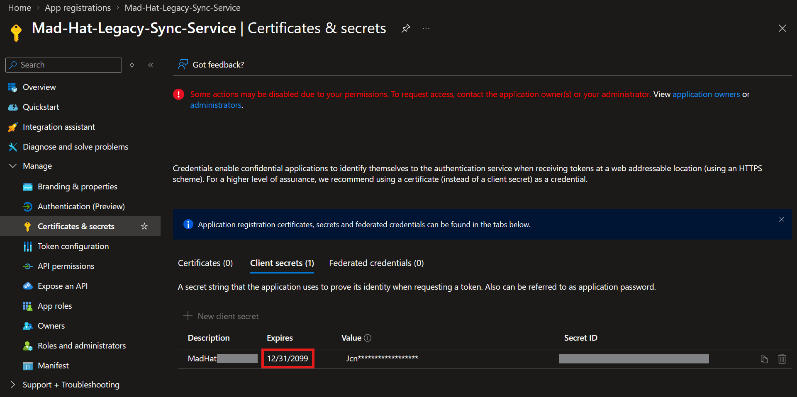
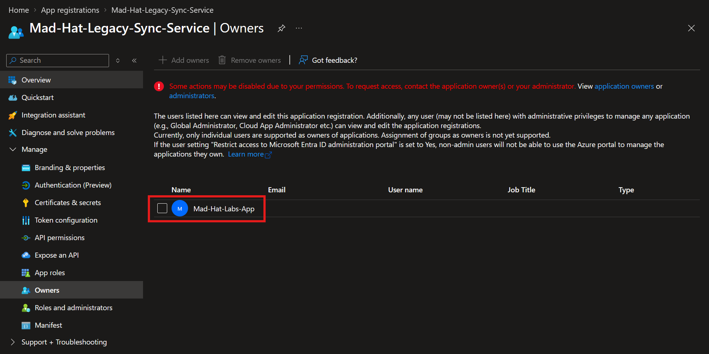
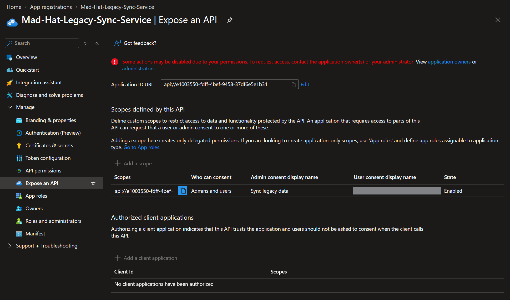
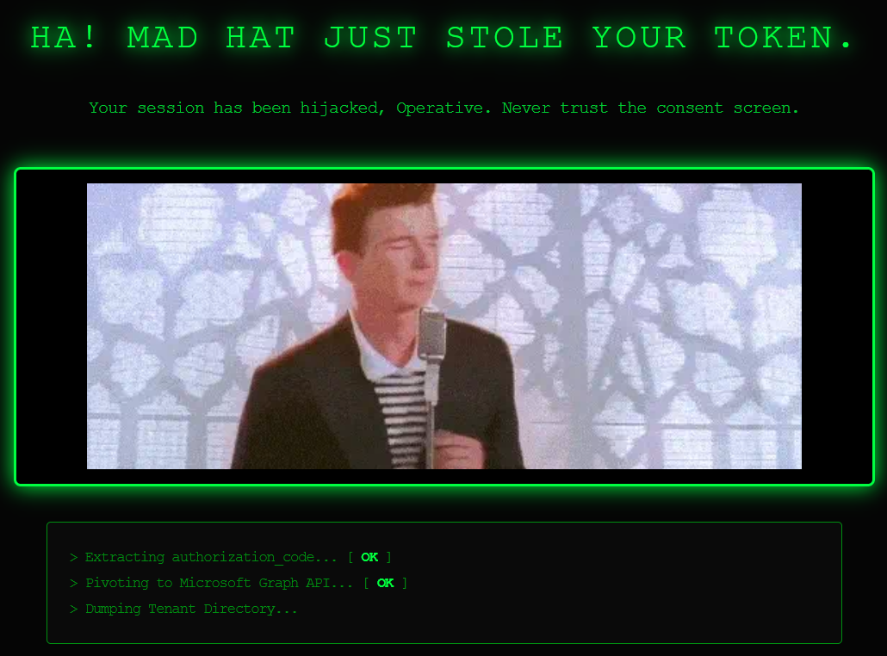

# The Stolen Identity

## Scenario
Reconstructed a five-stage OAuth consent-phishing kill chain in a live Azure tenant through forensic analysis of two linked app registrations.

## Environment
Live multi-user Azure training tenant, Reader access.

## Investigation
#### 1. ENTRY
A user was phished, completed MFA, and had the resulting session token stolen. That token carried an MFA-satisfied claim, so it sailed past Conditional Access. That user was also, through years of drift, still an Owner on a legacy connector app.  

#### 2. ESCALATE
Using those Owner rights, the attacker minted a new client secret on the legacy app. That secret let them authenticate through the client credentials flow as the service principal itself, inheriting the app's directory permissions without ever signing in as a human again.  
**Note the expiry date:** Set nearly a century out, this is the attackers persistence mechanism.

#### 3. PIVOT
A single secret dies when it gets rotated. So the attacker registered their own app (every standard user can do this by default in Entra) and added its service principal to the legacy app's Owners list. Now they can re-credential the legacy app forever, even after the first secret is caught.  

#### 4. PERSIST
Then the backup plan: a custom scope published on the legacy app's Expose an API blade. This turns the legacy app into a callable backend resource, which means the attacker's own app can request delegated access to it.  

#### 5. LOOT
Finally, a redirect URI on the rogue app pointing at attacker-controlled infrastructure. Combining the rogue app's client ID, that redirect URI, and the exposed API scope produces a working phishing URL. A victim who is already signed in on a corporate device clicks Accept on a consent prompt, and the authorization code lands on the attacker's server.  

## Why does this attack exist?
This is called a **Confused Deupty** attack. A threat actor would use this method to phish concent instead of credentials. Phishing credentials can be protected against with Conditional Access policies requiring MFA, device compliance, location, etc. But once a user grants concent for a rouge app, the resulting OAuth2PermissionGrant is not removed by a password reset, not removed by revoking sessions, and not removed by enforcing MFA.

## What broke / what surprised me
I was surprised that standard users can register apps in Entra ID by default.  
Owning an app registration can be abused as an unlogged privilege path that a review of Global Admins or user roles would completely miss.

## Findings and recommendations
revoke the client secret · remove the rogue service principal from Owners · delete the custom exposed API scope · revoke the OAuth2PermissionGrant explicitly, because containment does not remove it · remove the attacker redirect URI · review and reduce the Graph application permissions · disable default user app registration · audit every app registration's Owners list the same way you audit directory role membership · alert on new client secrets and new redirect URIs.

## What I learned
I learned that the service principal of an app can be an owner of another app.